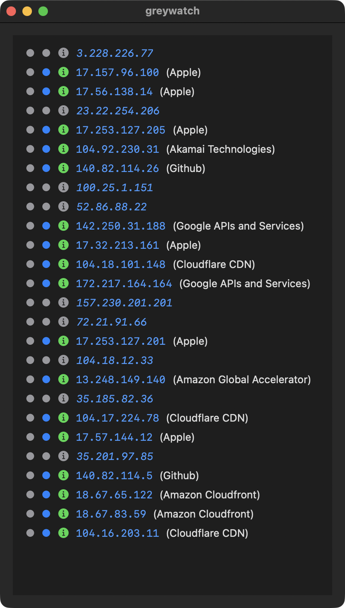

#  greywatch

Andrew Morris (Greynoise founder) and the GN team released a free community API this week (2021-03-26) and then Andrew posted a super hacky shell one liner — https://twitter.com/Andrew___Morris/status/1375516879351992320?s=20 — that shows how to use it.

I made some improvements on that but shells are so 2020.

If you've got BigSur, compile this  Xcode project or grab the release and you can have app on the side that updates every 30 seconds (will be configurable at some point) and shows the established TCP connections (only new ones going forward) with color annotations to show if an IP is super bad (on GN naught list) and/or part of the RIOT (community IP classifications).

Clicking on an entry that has GN/RIOT metadata takes you to the GN/RIOT page for the IP.

Clicking on an entry that has no GN/RIOT metadata takes you to the astoundingly useful IPInfo site.

File issues for feature requests or bugs.

